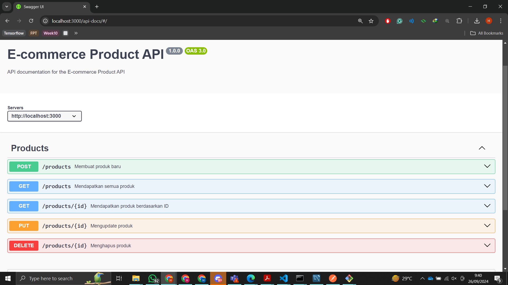

# E-commerce Backend API

Backend API sederhana untuk katalog produk e-commerce menggunakan **Express.js** dan **MySQL**, serta didokumentasikan dengan **Swagger**.

## Fitur API

- **POST** `/products` - Menambah produk baru
- **GET** `/products` - Mendapatkan semua produk
- **GET** `/products/{id}` - Mendapatkan produk berdasarkan ID
- **PUT** `/products/{id}` - Mengupdate produk berdasarkan ID
- **DELETE** `/products/{id}` - Menghapus produk berdasarkan ID

## Persyaratan

Sebelum menjalankan proyek ini, pastikan Anda sudah menginstal perangkat lunak berikut:

- [Node.js](https://nodejs.org/en/download/)
- [MySQL](https://dev.mysql.com/downloads/installer/)

## Instalasi

### 1. Clone Repository

Clone repository ini ke komputer lokal Anda:

```bash
git clone https://github.com/username/ecommerce-backend.git
cd ecommerce-backend
```

### 2. Install Dependencies

Install dependencies Node.js yang diperlukan:

```bash
npm install
```

### 3. Buat Database MySQL

1. Buka **MySQL** dan buat database baru untuk aplikasi ini:

```sql
CREATE DATABASE ecommerce_db;
```

2. Setelah database dibuat, jalankan script SQL yang tersedia untuk membuat tabel dan mock data:

```bash
mysql -u root -p ecommerce_db < sql/create_tables.sql
mysql -u root -p ecommerce_db < sql/seed_data.sql
```

> **Catatan**: Ganti `root` dan `password` dengan kredensial MySQL Anda.

### 4. Konfigurasi Koneksi Database

Buka file `db.js` dan sesuaikan konfigurasi koneksi database Anda:

```javascript
const pool = mysql.createPool({
  host: 'localhost',      // Host MySQL Anda
  user: 'root',           // Username MySQL Anda
  password: '',           // Password MySQL Anda
  database: 'ecommerce_db', // Nama database
});
```

### 5. Jalankan Server

Setelah semua setup selesai, jalankan server dengan perintah:

```bash
node index.js
```

Anda akan melihat output berikut jika server berhasil dijalankan:

```
Server berjalan di port 3000
```

Di sana Anda dapat mencoba endpoint API langsung dari browser.

## Penggunaan

### 1. Menambah Produk Baru (POST `/products`)

**Request Body:**

```json
{
  "name": "Jam Tangan",
  "location": "Yogyakarta",
  "material": "Baja",
  "size": "Standar",
  "weight": 0.1,
  "rating": 4.6,
  "stock": 80,
  "total_sold": 120,
  "tax": 5.00,
  "price": 750000.00,
  "description": "Jam tangan elegan"
}
```

### 2. Mendapatkan Semua Produk (GET `/products`)

```bash
curl -X GET http://localhost:3000/products
```

### 3. Mendapatkan Produk Berdasarkan ID (GET `/products/{id}`)

```bash
curl -X GET http://localhost:3000/products/1
```

### 4. Mengupdate Produk (PUT `/products/{id}`)

**Request Body:**

```json
{
  "name": "Jam Tangan",
  "location": "Bandung",
  "material": "Kulit",
  "size": "Large",
  "weight": 0.15,
  "rating": 4.8,
  "stock": 100,
  "total_sold": 250,
  "tax": 10.00,
  "price": 1200000.00,
  "description": "Jam tangan premium"
}
```

### 5. Menghapus Produk (DELETE `/products/{id}`)

```bash
curl -X DELETE http://localhost:3000/products/1
```

## Akses API Documentation (Swagger)

Anda dapat mengakses dokumentasi API menggunakan **Swagger** di browser:

```
http://localhost:3000/api-docs
```

